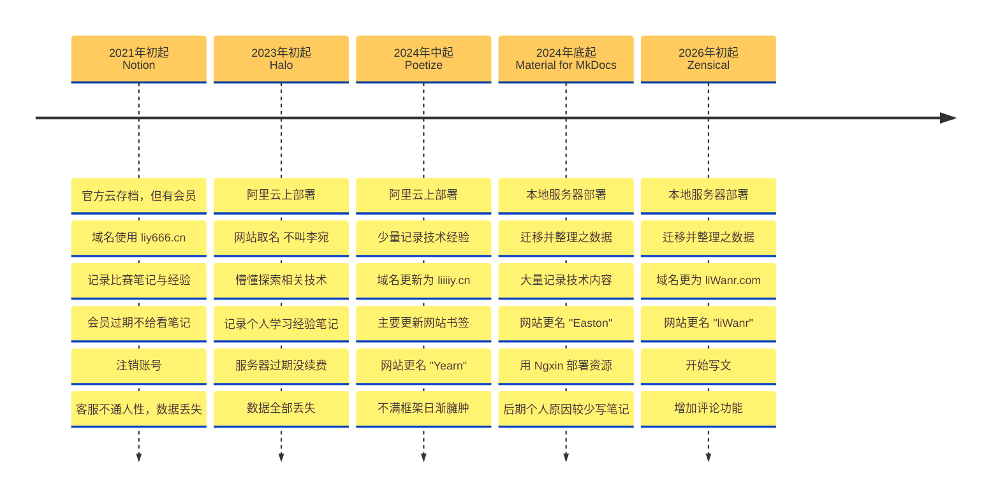

<link rel="stylesheet" href="/assets/stylesheets/about.css">

## :lucide-ev-charger: Powered By

///html | div.grid.cards
-   :lucide-bug-play: **框架生成**

    ---
    
    网站基于现代静态网站生成器
    [Zensical](https://zensical.org/)
    搭建而成。

-   :lucide-cloud-upload: **托管平台**

    ---

    [Local Server](http://local.liwanr.com:24)
    / [Cloudflare](https://www.cloudflare.com)
    / [GitHub Pages](https://docs.github.com/pages)
    / [Vercel](https://vercel.com/)
    / [Netlify](https://www.netlify.com/)
    
-   :lucide-code-xml: **编码存储**

    ---
    
    代码通过
    [Visual Studio Code](https://code.visualstudio.com/)
    编写并存储于
    [GitHub](https://github.com/github)
    公开仓库中。

-   :lucide-type-outline: **字体样式**

    ---
    
    常规文字采用
    [MiSans](https://hyperos.mi.com/font)
    , 等宽文字采用
    [JetBrains Mono](https://www.jetbrains.com/lp/mono/)。
///

## :lucide-computer: Setup

编程机 · Dev Machine

///html | div.grid.cards[style='font-family: JetBrains Mono;']
-   <small>:material-apple-finder: MacOS</small> 
    **M3Pro MacBook Pro 14" 2023** 
    18GB RAM
    512GB SSD

-   <small>:simple-linux: Linux</small> 
    **RTX 3060 ROG M16  2021** 
    i7-11800H
    16GB RAM
    <small>[:lucide-mouse-pointer-click:去看看](https://rog.asus.com.cn/laptops/rog-zephyrus/2021-rog-zephyrus-m16-series/)</small>
///

游戏主机

System Specs

///html | div.grid.cards[style='grid-template-columns: repeat(auto-fit, minmax(min(100%, 15rem), 1fr)); font-family: JetBrains Mono;']
-   <small>:lucide-layout-dashboard: 主板</small> 
    **ASUS TUF GAMING B650M-PLUS** 
    光环同步
    WIFI 6E
    <small>[:lucide-mouse-pointer-click:去看看](https://www.asus.com/us/motherboards-components/motherboards/tuf-gaming/tuf-gaming-b850m-plus-wifi/)</small>

-   <small>:lucide-cpu: CPU</small> 
    **AMD Ryzen™ 7 7800X3D** 
    3D V-Cache
    8 核心
    <small>[:lucide-mouse-pointer-click:去看看](https://www.amd.com/en/products/processors/desktops/ryzen/7000-series/amd-ryzen-7-7800x3d.html)</small>

-   <small>:lucide-gpu: GPU</small> 
    **GeForce RTX 4070 Ti SUPER** 
    16 GB
    iGame Advanced OC
    <small>[:lucide-mouse-pointer-click:去看看](https://www.colorful.cn/home/product?mid=102&id=951619eb-5066-4258-810e-c5ec2bbd32be)</small>

-   <small>:lucide-memory-stick: RAM</small> 
    **XPG D300 16 GB × 2** 
    6000 MHz
    DDR5
    <small>[:lucide-mouse-pointer-click:去看看](https://xpg.adata.com.cn/cn/xpg/dram-modules-lancer-rgb-ddr5?tab=desc)</small>

-   <small>:lucide-hard-drive: 存储</small> 
    **Predator GM7000  1 TB** 
    PCIe4.0
    M.2 SSD
    <small>[:lucide-mouse-pointer-click:去看看](https://www.predatorstorage.com/products/pcie-m-2-ssd/predator-gm7000-pcie-4-ssd/)</small>

-   <small>:lucide-hard-drive: 存储</small> 
    **WesternDigital Blue 2 TB** 
    256MB
    7200RPM
    <small>[:lucide-mouse-pointer-click:去看看](https://www.westerndigital.com/products/internal-drives/wd-blue-desktop-sata-hdd?sku=WD20EZBX)</small>

-   <small>:lucide-fan: 散热器</small> 
    **TCOMAS SJ-A090 360** 
    水冷
    35.7dB
    <small>[:lucide-mouse-pointer-click:去看看](https://cougargaming.com/products/cases/mx600-rgb/)</small>

-   <small>:lucide-zap: 电源</small> 
    **GreatWall F-850BL (92+) F8MP** 
    850W
    92%效率
    <small>[:lucide-mouse-pointer-click:去看看](https://www.gwpst.cn/product/detail/301.html)</small>

-   <small>:lucide-pc-case: 机箱</small> 
    **GOUGAR MX600 RGB Black** 
    全塔
    风扇≦9
    <small>[:lucide-mouse-pointer-click:去看看](https://cougargaming.com/products/cases/mx600-rgb/)</small>
///

外设 · Peripherals

///html | div.grid.cards[style='font-family: JetBrains Mono;']

-   <small>:lucide-monitor: 显示器</small> 
    **SANC G73 2K** 
    240Hz
    27"
    <small>[:lucide-mouse-pointer-click:去看看](http://www.ccclcd.com/high-end-esports-g-series/537233)</small>

-   <small>:lucide-keyboard: 键盘</small> 
    **Keychron K3 Max 专供版复古灰** 
    矮轴
    三模
    <small>[:lucide-mouse-pointer-click:去看看](https://www.keychron.com/products/keychron-k3-max-qmk-via-wireless-custom-mechanical-keyboard?variant=42752630915161)</small>

-   <small>:lucide-headset: 耳机</small> 
    **Bose QC35 II Gaming** 
    降噪
    无线
    <small>[:lucide-mouse-pointer-click:去看看](https://support.bose.com/s/product/quietcomfort-35-ii-gaming-headset/01t8c00000OydAGAAZ?language=en_US)</small>

-   <small>:lucide-mouse: 鼠标</small> 
    **ROG Gladius III Wireless AimPoint** 
    79g
    119h+
    <small>[:lucide-mouse-pointer-click:去看看](https://rog.asus.com/mice-mouse-pads/mice/ergonomic-right-handed/rog-gladius-iii-wireless-aimpoint-model/)</small>
///

## :lucide-scale: License
///html | div[style='font-family: JetBrains Mono;']
**MIT License**

Copyright (c) 2026 liWanr

Permission is hereby granted, free of charge, to any person obtaining a copy of this software and associated documentation files (the “Software”), to deal in the Software without restriction, including without limitation the rights to use, copy, modify, merge, publish, distribute, sublicense, and/or sell copies of the Software, and to permit persons to whom the Software is furnished to do so, subject to the following conditions:

The above copyright notice and this permission notice shall be included in all copies or substantial portions of the Software.

THE SOFTWARE IS PROVIDED “AS IS”, WITHOUT WARRANTY OF ANY KIND, EXPRESS OR IMPLIED, INCLUDING BUT NOT LIMITED TO THE WARRANTIES OF MERCHANTABILITY, FITNESS FOR A PARTICULAR PURPOSE AND NONINFRINGEMENT. IN NO EVENT SHALL THE AUTHORS OR COPYRIGHT HOLDERS BE LIABLE FOR ANY CLAIM, DAMAGES OR OTHER LIABILITY, WHETHER IN AN ACTION OF CONTRACT, TORT OR OTHERWISE, ARISING FROM, OUT OF OR IN CONNECTION WITH THE SOFTWARE OR THE USE OR OTHER DEALINGS IN THE SOFTWARE.
///

## :lucide-cookie: Privacy Policy

网站本体是完全静态的页面，不会收集任何用户数据，但网站所依赖的外部服务可能会有收集数据，**本站不对外部服务商的隐私政策负责**，请用户自行查阅这些服务商的隐私政策。

-  **Cloudflare**: 网站使用了 Cloudflare 的 CDN 服务来加速内容传输，Cloudflare 可能会收集访问者的 IP 地址、浏览器类型、访问时间等信息以优化性能和安全性。详细信息请参阅 [Cloudflare隐私政策](https://www.cloudflare.com/privacypolicy/)。

- **GitHub**: 网站的源代码托管在 GitHub 上，GitHub 可能会收集用户的账户信息、访问日志等数据。详细信息请参阅 [GitHub 隐私政策](https://docs.github.com/site-policy/privacy-policies/github-privacy-statement)。

- **Google Analytics**: 网站使用了 Google Analytics 来分析访问者的行为，Google Analytics 可能会收集访问者的 IP 地址、浏览器类型、访问时间等信息以提供统计数据。详细信息请参阅 [Google Analytics 隐私政策](https://policies.google.com/privacy)。

- **Giscus**: 网站使用了 Giscus 来提供评论功能，giscus 可能会收集用户的 GitHub 账户信息、评论内容等数据。详细信息请参阅 [Giscus 隐私政策](https://giscus.app/privacy)。