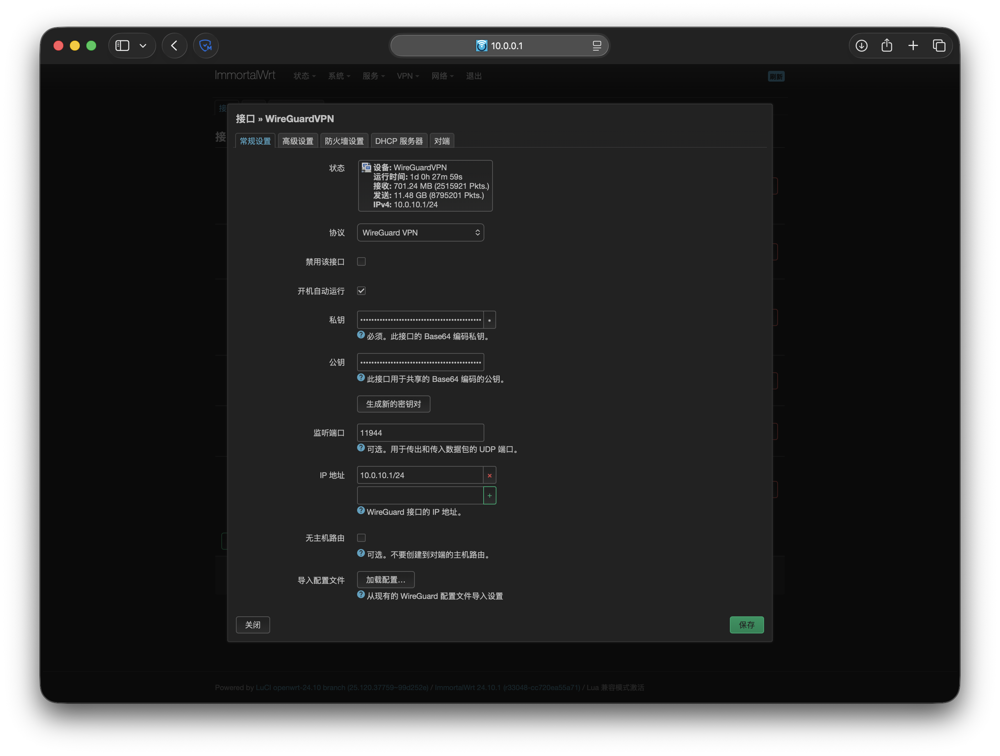
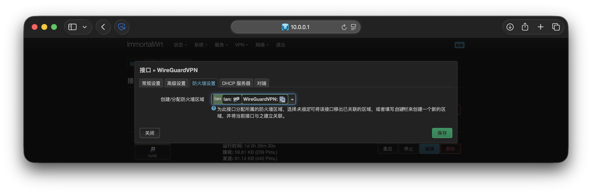
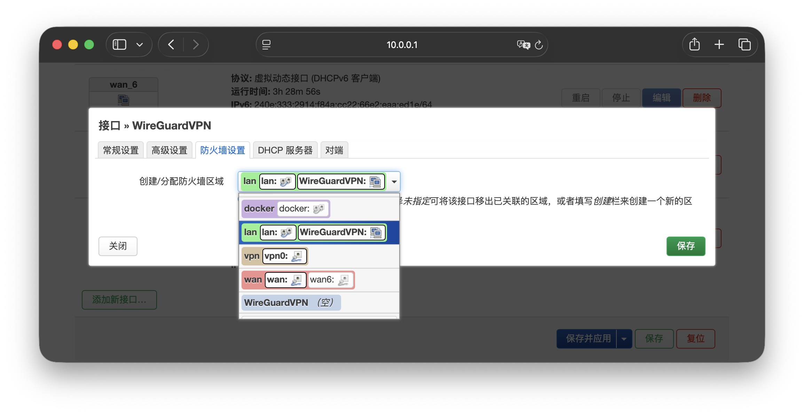
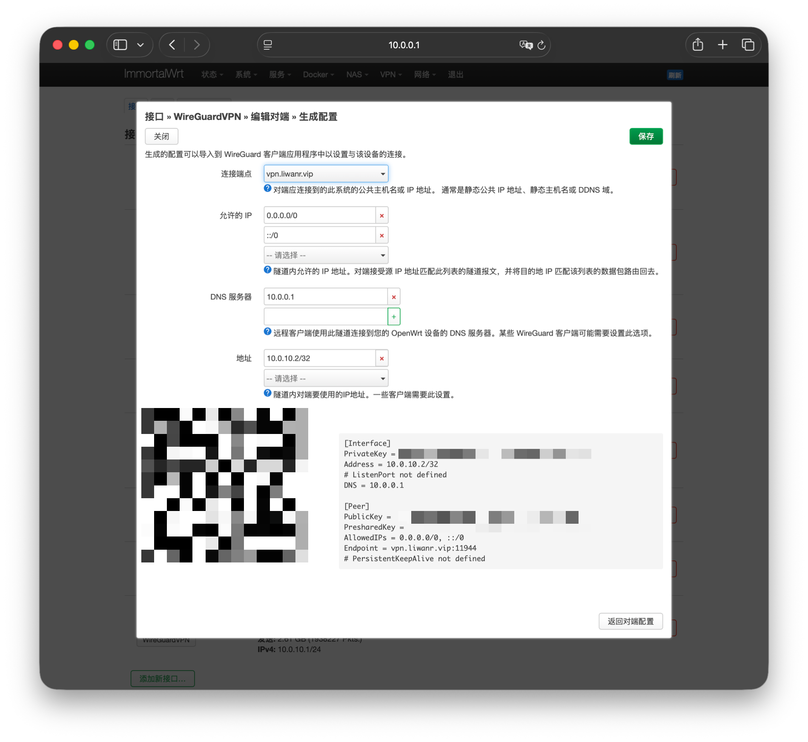
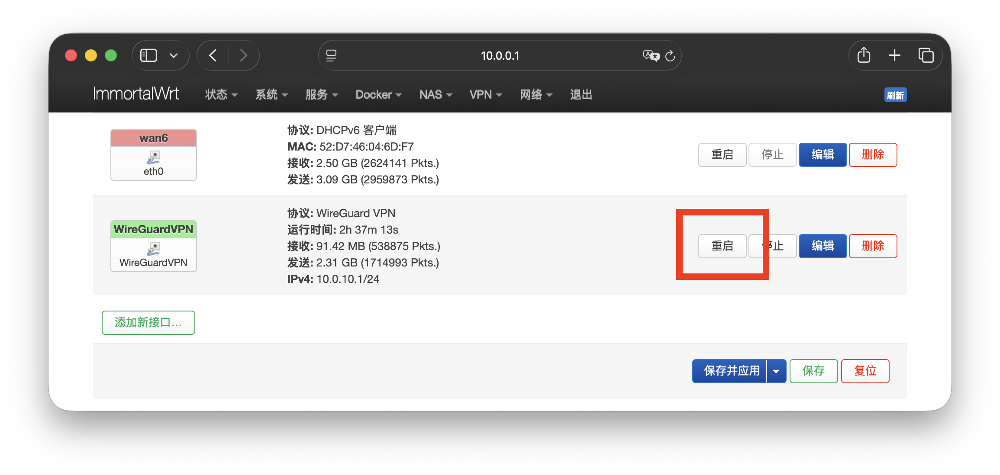

## 引言

这篇文章算是进阶或者改善异地组网的文章, 最主要的目的就是为了改善 OpenVPN 的速度和延迟问题。

| 对比内容 | WireGuard | OpenVPN |
| - | - | - |
| 速度 / 吞吐 | 通常最快 常比 OpenVPN 快 2–4 倍 | 较慢 即使 UDP 模式也 | 慢 20–50% |
| 延迟 | 极低 | 较高 |
| CPU 占用 | 非常低 ChaCha20-Poly1305 现代高效算法 | 较高 尤其无 AES-NI 加速时 |
| 移动设备续航 | 优秀, 切换网络/休眠唤醒快 | 较差, 耗电明显 |
| 重连速度 / 握手 | 极快, <1秒, 通常瞬间完成 | 较慢, 几秒到十几秒 |
| TCP 支持 | 只支持 UDP | 支持 TCP 和 UDP TCP 443 伪装 HTTPS 能力强 |
| 端口伪装 / 绕过 | 较难伪装, 固定 UDP | 极强, 可走 443 / TCP, 像 HTTPS 流量 |
| 兼容性 | 几乎所有主流平台原生支持, 包括内核级 | 非常广泛, 老设备、路由器、企业设备支持更好 |
| NAT 穿越 / 断线重连 | 优秀, 内置 roaming 支持 | 一般, 需额外 keepalive 配置 |

## 配置

### 安装

首先去『**系统 - 软件包 - 过滤器**』中搜索 `wireguard`, 一共有 wireguard-tools / kmod-wireguard / luci-proto-wireguard 三个包, 然后分别安装就行了, 他会自动下载安装各自所需的依赖, 下载完成之后重启一下路由器就行了。

### 新建 NAT 规则

去『**网络 - 防火墙 - NAT 规则**』中按照以下创建保存完成注意右上角的「**未保存的配置为 4**」。没什么问题就『**保存并应用**』。

### 创建接口

1. 去『**网络 - 接口 - 接口**』的底部点击『**添加新接口…**』, 去创建一个新接口, 名称随便取, 主要是协议为「**WireGuard VPN**」。

2. 然后在『**常规设置**』中按照下图内容进行配置, 其中表格中的内容需要注意一下,  其他默认即可。配置完之后点击『**保存**』, 此时右上角的「**未保存的配置为 5**」, 然后点击右下角的『**保存并应用**』。

    |项目|备注|
    |-|-|
    | 私钥 / 公钥 | 这个点击『**生成新的密钥对**』就行了, 不需要自己手动输入, 当然想自己输入也可以 |
    | 监听端口 | 这个找一个没用过的端口就行了, 我配置 `11944` 是因为 OpenVPN 的端口是 `1194` |
    | IP 地址 | 这个就是 VPN 的网关 IP, 只要避开路由器 IP 就行了, 但是得注意掩码位是 `24` |
    
    

3. 再次编辑这个接口, 去『**防火墙设置**』中将『**创建/分配防火墙区域**』配置为「**lan口**」。然后点击『**保存**』, 此时右上角的「**未保存的配置为 4**」, 接着点击右下角的『**保存并应用**』。

    

4. 最后再次编辑这个接口, 去『**对端**』中『**添加对端**』。按照下图内容进行配置, 其中表格中的内容需要注意一下,  其他默认。

    |项目|备注|
    |-|-|
    | 私钥 / 公钥 | 这个点击『**生成新的密钥对**』就行了 |
    | 预共享密钥 | 这个点击『**生成预共享密钥**』就行了 |
    | 允许的 IP | 填一个没用过的 IP 就行, 但是网段必须是刚才填的 VPN 网关下的网段, 注意掩码位是 `32` |

    

    然后点击『**生成配置...**』, 将连接端点改成动态解析的域名, 或者固定 IP, 否则 IP 一变就用不了了。配置完之后点击『**保存**』, 此时右上角的「**未保存的配置为 6**」, 然后点击右下角的『**保存并应用**』。

    

5. 完成之后『**重启**』一下这个接口

    

## 连接

去 [**Wire Guard 官网**](https://www.wireguard.com/install/) 找到对应版本下载, 移动端可以通过配置时生成的二维码进行扫码连接。Apple 生态需要**外区账号**才能在 App Store 下载。

可以在 OpenWrt 的『**状态 - WireGuard**』中查看握手状态。